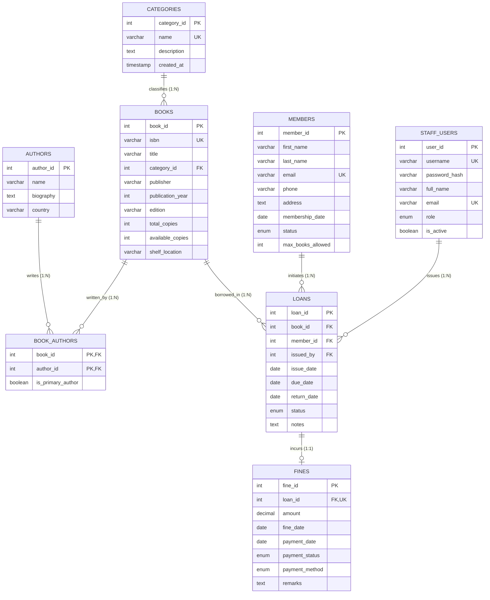

# Database Management System (DBMS) Project Documentation
# Library Management System

---

## 1. Executive Summary & Problem Definition
A **Library Management System (LMS)** is an enterprise database application designed to automate the operations of academic, corporate, and public libraries. Manual library operations suffer from data redundancy, inconsistent loan tracking, lost books, uncollected overdue fines, and lack of real-time inventory visibility.

This project delivers a **Relational Database Management System (RDBMS)** built upon **MySQL**, normalized up to **3NF / BCNF**, enforcing complete referential integrity, automated business rules via **Triggers**, pre-computed analytical projections via **Views**, and safe concurrency with **ACID Stored Procedures**.

---

## 2. Entity-Relationship (ER) Modeling

### 2.1 Entity Sets and Attributes

| Entity | Type | Primary Key (PK) | Attributes | Description |
| :--- | :--- | :--- | :--- | :--- |
| **CATEGORIES** | Strong | `category_id` | `name` (Unique), `description` | Broad genre/domain classification |
| **AUTHORS** | Strong | `author_id` | `name`, `biography`, `country` | Authors of literary and academic works |
| **BOOKS** | Strong | `book_id` | `isbn` (Unique), `title`, `publisher`, `publication_year`, `edition`, `total_copies`, `available_copies`, `shelf_location` | Core book catalog inventory |
| **BOOK_AUTHORS** | Associative / Junction | `(book_id, author_id)` | `is_primary_author` | Resolves M:N relationship between Books and Authors |
| **MEMBERS** | Strong | `member_id` | `first_name`, `last_name`, `email` (Unique), `phone`, `address`, `membership_date`, `status`, `max_books_allowed` | Registered library patrons |
| **STAFF_USERS** | Strong | `user_id` | `username` (Unique), `password_hash`, `full_name`, `email` (Unique), `role`, `is_active` | Authorized librarians and admins |
| **LOANS** | Transactional Entity | `loan_id` | `issue_date`, `due_date`, `return_date`, `status`, `notes` | Tracks borrowing life cycle |
| **FINES** | Dependent Entity | `fine_id` | `amount`, `fine_date`, `payment_date`, `payment_status`, `payment_method`, `remarks` | Overdue and penalty tracking |

---

### 2.2 Relationship Types and Cardinalities

```
1. CATEGORIES to BOOKS
   - Type: One-to-Many (1 : N)
   - Cardinality: One category contains zero or many books. A book belongs to exactly one category.
   - Participation: BOOKS (Total), CATEGORIES (Partial).

2. BOOKS to AUTHORS (via BOOK_AUTHORS)
   - Type: Many-to-Many (M : N)
   - Cardinality: A book can be co-authored by multiple authors. An author can write multiple books.
   - Implementation: Decomposed into two 1:N relationships using junction table BOOK_AUTHORS.

3. MEMBERS to LOANS
   - Type: One-to-Many (1 : N)
   - Cardinality: One member can have multiple loan transactions over time. Each loan belongs to exactly one member.
   - Participation: LOANS (Total), MEMBERS (Partial).

4. BOOKS to LOANS
   - Type: One-to-Many (1 : N)
   - Cardinality: One book title can be borrowed multiple times across history. Each loan references one book.
   - Participation: LOANS (Total), BOOKS (Partial).

5. STAFF_USERS to LOANS
   - Type: One-to-Many (1 : N)
   - Cardinality: One staff member can issue many loans. Each loan is issued by one staff user.

6. LOANS to FINES
   - Type: One-to-One (1 : 1) / Zero-to-One
   - Cardinality: A loan generates at most one fine record if returned late. A fine is tied to exactly one loan.
```

---

### 2.3 Crow's Foot ER Diagram



---

## 3. Relational Schema & Normalization Proof

### 3.1 Relational Schema Representation
```
CATEGORIES (
    category_id [PK], 
    name [UNIQUE], 
    description, 
    created_at
)

AUTHORS (
    author_id [PK], 
    name, 
    biography, 
    country, 
    created_at
)

BOOKS (
    book_id [PK], 
    isbn [UNIQUE], 
    title, 
    category_id [FK -> CATEGORIES.category_id], 
    publisher, 
    publication_year, 
    edition, 
    total_copies, 
    available_copies, 
    shelf_location, 
    created_at, 
    updated_at
)

BOOK_AUTHORS (
    book_id [PK, FK -> BOOKS.book_id], 
    author_id [PK, FK -> AUTHORS.author_id], 
    is_primary_author
)

MEMBERS (
    member_id [PK], 
    first_name, 
    last_name, 
    email [UNIQUE], 
    phone, 
    address, 
    membership_date, 
    status, 
    max_books_allowed, 
    created_at
)

STAFF_USERS (
    user_id [PK], 
    username [UNIQUE], 
    password_hash, 
    full_name, 
    email [UNIQUE], 
    role, 
    is_active, 
    created_at
)

LOANS (
    loan_id [PK], 
    book_id [FK -> BOOKS.book_id], 
    member_id [FK -> MEMBERS.member_id], 
    issued_by [FK -> STAFF_USERS.user_id], 
    issue_date, 
    due_date, 
    return_date, 
    status, 
    notes, 
    created_at, 
    updated_at
)

FINES (
    fine_id [PK], 
    loan_id [FK -> LOANS.loan_id, UNIQUE], 
    amount, 
    fine_date, 
    payment_date, 
    payment_status, 
    payment_method, 
    remarks, 
    created_at, 
    updated_at
)
```

---

### 3.2 Normalization Stages

#### 1. First Normal Form (1NF)
- **Rule**: Every attribute contains atomic (indivisible) values, and each record is unique.
- **Compliance**:
  - Author names are stored in an independent `AUTHORS` table rather than comma-delimited strings in the `BOOKS` table.
  - Multi-valued author relationships are normalized using `BOOK_AUTHORS`.
  - Member names are partitioned into atomic attributes (`first_name`, `last_name`).

#### 2. Second Normal Form (2NF)
- **Rule**: Table is in 1NF and contains **NO Partial Functional Dependencies** (every non-key attribute is fully functionally dependent on the entire primary key).
- **Compliance**:
  - The only composite key exists in `BOOK_AUTHORS (book_id, author_id)`. The non-key attribute `is_primary_author` depends strictly on the combination of `(book_id, author_id)`, not just one of them.
  - Book metadata depends solely on `book_id`, not on authors or categories.

#### 3. Third Normal Form (3NF)
- **Rule**: Table is in 2NF and contains **NO Transitive Dependencies** ($X \rightarrow Y$ and $Y \rightarrow Z$, where non-key attribute $Z$ depends on non-key attribute $Y$).
- **Compliance**:
  - Category details (`name`, `description`) are isolated in `CATEGORIES`. In `BOOKS`, only `category_id` is stored. There is no transitive dependence of category name on `book_id`.
  - Member contact info is isolated in `MEMBERS`. The `LOANS` table only stores `member_id`.

#### 4. Boyce-Codd Normal Form (BCNF)
- **Rule**: For every non-trivial functional dependency $X \rightarrow Y$, $X$ must be a superkey.
- **Compliance**:
  - In all tables (`CATEGORIES`, `AUTHORS`, `BOOKS`, `MEMBERS`, `STAFF_USERS`, `LOANS`, `FINES`), the determinants for all functional dependencies are Primary Keys or Candidate Keys (`isbn`, `email`, `username`).

---

## 4. Integrity Constraints Summary

1. **Entity Integrity**: Every table has a designated non-null `PRIMARY KEY`.
2. **Referential Integrity**: All foreign keys reference valid parent rows with appropriate `ON UPDATE CASCADE` and `ON DELETE RESTRICT / CASCADE / SET NULL` actions.
3. **Domain Integrity**:
   - `available_copies >= 0` AND `available_copies <= total_copies`
   - `amount >= 0.00`
   - `status ENUM('Active', 'Returned', 'Overdue')`
   - `publication_year BETWEEN 1000 AND 2100`
4. **Key Integrity**: `UNIQUE` constraints on `books.isbn`, `members.email`, `staff_users.username`, `categories.name`, `fines.loan_id`.

---

## 5. Advanced DBMS Features Implemented

### 5.1 Triggers
1. **`trg_after_loan_insert`**: Automatically decrements the `available_copies` count of the issued book whenever a new loan is created.
2. **`trg_after_loan_update`**: Automatically increments `available_copies` by 1 when the book's `return_date` is populated.
3. **`trg_auto_create_fine_on_return`**: Automatically computes overdue duration ($return\_date - due\_date$) and inserts/updates a fine record at \$2.00/day if returned past the due date.

### 5.2 Stored Procedures & ACID Transactions
1. **`sp_issue_book`**:
   - Performs row-level locking (`FOR UPDATE`).
   - Validates that `available_copies > 0`.
   - Validates member active status, active loan limits (e.g. max 5 books), and checks for unpaid overdue fines.
   - Atomically creates loan and decrements stock within a transaction (`COMMIT`/`ROLLBACK`).
2. **`sp_return_book`**:
   - Validates that the loan is active and not previously returned.
   - Computes overdue fine.
   - Updates return date, status, and restores stock inside an atomic transaction.

### 5.3 Database Views
1. **`v_book_catalog`**: Unified projection concatenating multiple authors, genre names, and real-time stock status.
2. **`v_active_loans`**: Real-time view of currently borrowed books, loan duration, and calculated status.
3. **`v_overdue_loans`**: Real-time projection of overdue borrowers with contact information and calculated fines.
4. **`v_popular_books`**: Aggregated analytics computing borrow frequency per book title.
